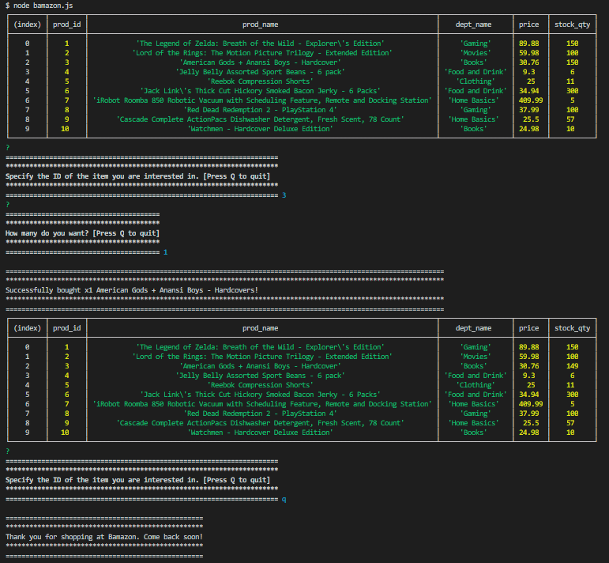

# Bamazon
Amazon-like storefront created  using MySQL Workbench and Node.js. The app takes in orders from customers and depletes stock from the store's inventory database.


## Website
https://onix-xcc.github.io/Bamazon/

### Prerequisites 

```
1. Create a MySQL Database called bamazon_db.

2. Then create a Table inside of that database called merch.

3. The products table should have each of the following columns:

    * prod_id (unique id for each product)
    * prod_name (Name of product)
    * dept_name
    * price (cost to customer)
    * stock_qty (stock of items in the store)

```

## Terminal Walk-Through

To search Bamazon:

* node bamazon.js

```

┌─────────┬─────────┬────────────────────────────────────────────────────────────────────────────────────────┬──────────────────┬────────┬───────────┐
│ (index) │ prod_id │                                       prod_name                                        │    dept_name     │ price  │ stock_qty │
├─────────┼─────────┼────────────────────────────────────────────────────────────────────────────────────────┼──────────────────┼────────┼───────────┤
│    0    │    1    │            'The Legend of Zelda: Breath of the Wild - Explorer\'s Edition'             │     'Gaming'     │ 89.88  │    149    │
│    1    │    2    │           'Lord of the Rings: The Motion Picture Trilogy - Extended Edition'           │     'Movies'     │ 59.98  │    99     │
│    2    │    3    │                       'American Gods + Anansi Boys - Hardcover'                        │     'Books'      │ 30.76  │    150    │
│    3    │    4    │                      'Jelly Belly Assorted Sport Beans - 6 pack'                       │ 'Food and Drink' │  9.3   │     6     │
│    4    │    5    │                              'Reebok Compression Shorts'                               │    'Clothing'    │   25   │    11     │
│    5    │    6    │             'Jack Link\'s Thick Cut Hickory Smoked Bacon Jerky - 6 Packs'              │ 'Food and Drink' │ 34.94  │    300    │
│    6    │    7    │ 'iRobot Roomba 850 Robotic Vacuum with Scheduling Feature, Remote and Docking Station' │  'Home Basics'   │ 409.99 │     5     │
│    7    │    8    │                        'Red Dead Redemption 2 - PlayStation 4'                         │     'Gaming'     │ 37.99  │    100    │
│    8    │    9    │       'Cascade Complete ActionPacs Dishwasher Detergent, Fresh Scent, 78 Count'        │  'Home Basics'   │  25.5  │    57     │
│    9    │   10    │                         'Watchmen - Hardcover Deluxe Edition'                          │     'Books'      │ 24.98  │    10     │
└─────────┴─────────┴────────────────────────────────────────────────────────────────────────────────────────┴──────────────────┴────────┴───────────┘
?
=====================================================================
*********************************************************************
Specify the ID of the item you are interested in. [Press Q to quit]
*********************************************************************
===================================================================== 2

```
* Type the amount of the product that you want to purchase.

```
?
=======================================
***************************************
How many do you want? [Press Q to quit]
***************************************
======================================= 9
```
* If the item is in stock you should get a purchase confirmation like the following:

```
===============================================================================================================
***************************************************************************************************************
Successfully bought x99 Lord of the Rings: The Motion Picture Trilogy - Extended Editions!
***************************************************************************************************************
===============================================================================================================
```
*If the item is out of stock or you pick an amount greater than the stock you should see the following message:

```
==============================
******************************
Don't have that many in stock!
******************************
==============================
```

* If for some reason you choose not to buy anything from Bamazon and type q to Quit you will see the following message:

```
==================================================
**************************************************
Thank you for shopping at Bamazon. Come back soon!
**************************************************
==================================================
```

## Screenshots

1. MySQL Workbench Bamazon Database 


2. node bamazon.js -> item purchase -> quantity -> purchase confirmation -> Q to Quit -> farewell message



## Acknowledgments

* Spent quite a while working on this code with Jose Torres (jt227b). Thank you for all of the help and helping me bounce ideas around. X100PRE